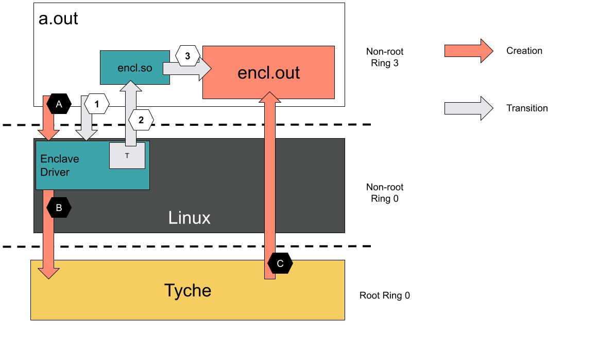

# Enclave abstraction driver.

This folder defines a kernel module that provides an API to create an enclave.

The kernel module interacts with tyche via vmcalls to build and transition into a confidential execution environment.

## Overview

 

This folder implements the enclave driver and the `encl.so` library.

A typical enclave creation and execution is implemented as follows:

---
1. Creating the enclave.

The user program `a.out` interacts with the `enclave driver` to create the `encl.out` enclave.

First, the enclave mmaps the encl.out program in its address space.
This allows to reserve virtual memory space in `a.out` address space that the driver will carve out later to create the enclave.

The enclave creation protocol starts with a call to create a new enclave.
The call should provide pre-defined `LABELS` in the `encl.so` library that reference context switching routines.
This returns an `encl_handle` that solely identifies this enclave. 

The `encl_handle` is then used by `a.out` to reference the enclave and to add memory regions (pages) to it.
To add a region, `a.out` makes calls with the following format to the `enclave driver`:

```
struct AddRegion {
  /// Unique enclave capability
  encl_handle: u64,
  
  /// Start address. Must be page aligned.
  start: u64,
  
  /// End address. Must be page aligned
  end: u64,
  
  /// Protection flags (RWX) for this region.
  flags: u64,
  
  /// Type of mapping: Confidential or Shared.
  type: enum RegionType
}
```

The driver has access to the kernel's metadata and thus identifies, for each region, the collection of physical frames `PhysFrames` backing them.
The `PhysFrames` are mapped by tyche into the enclave's EPTs.
Furthermore, if `AddRegion.type == Confidential`, the `PhysFrames` are removed from the current domain's EPT.

---

2. Interactions between the driver and Tyche

Tyche is agnostic to the `cr3` and only deals in trust domains and EPTs. 
As a result, we rely on a kernel driver to access guest virtual to guest physical mappings.
The driver is also responsible for instantiating shadow page tables for the enclave, which allows tp protect the enclave's integrity by preventing `encl.out`'s mappings from being modified by the `a.out` domain.

This shadow page table needs to have the following properties:

* The guest physical address of `shadow cr3` has to be the same as `cr3`.
* The `shadow cr3` and `cr3` host physical addresses (as well as intermediary page table entries) must be different.
* The PhysRanges used in `shadow cr3` page tables must be granted from the `a.out` domain to the `encl.out` domain with confidential access.
* The leaf mappings for any `AddRegion.start` virtual address need to have the same guest physical address in both `cr3` and `shadow cr3` and be backed by the same `PhysRange` in the respective EPTs.

The first requirement allows for a smooth `vmfunc` transition between the two domains.
The second requirement ensures that concurrent modifications to the `a.out` domain's page tables will not affect the `encl.out` mappings.
The third requirement ensures that `a.out` is unable to modify the `encl.out` mappings.
The fourth requirement ensures that `encl.out` is initialized with the correct content and that both domains can exchange information via shared mappings. 

This protocol implies that the driver must be able to allocate fresh pages from the kernel and grant them to the `encl.out` domain via interactions with tyche using vmcalls. 

Note here that the encl driver can batch operations (i.e., buffer them before performing a vmcall).
This reduces the number of vmexit drastically.

---

3. Tyche instantiation.

Tyche creates a new trust dommain and instantiate an associated new EPT table for the `encl.out` domain. 

We might want tyche to register an expected register state (including cr3) for entries to the domain.
This is to ensure that an enclave is always entered at the same point with a valid state and is crucial to avoid confused deputy attacks.
Let's refer to that state as `ValidEnclState`, an assume that it is a held on a page specified by the `enclave driver` in the previous step of the protocol.

---

4. Transitions between the domains

To guarantee the correct proceeding of the transitions between the two domains, we need to save the state of the current domain, perform a vmcall to secured trampoline, load the destination's state, and transition there.

Step 4 in the picture invokes the enclave's driver trampoline procedure.
This `vmfuncs` into a small domain under tyche's control marked as `T` in the figure.
The `T` domain has access to a buffer to save the current domain's state, as well as the `encl.so` mappings.

---
5. Second step of the transition

The domain `T` exposes the `ValidEnclState` to its copy of `encl.so`.
It returns to the `encl.so`, and loads the state for `encl.out`.

---

6. Third step of the transition.

The `encl.so` performs a vmfunc that targets the `encl.out` EPTs.
It should then land inside the `encl.so` within one of the `LABELS` (see top of this document) routines that will then yield execution to enclave code. 

The return from the enclave has to be performed in a similar way, going through `LABELS` routines and then the `T` domain that holds the state that needs to be restored before jumping back to the `a.out` domain. 

---

### Transition Discussion

Note that the above description of the transition mechanism is not final and needs to be experimented with.
This is a first attempt at providing a secured controlled transition between domains that avoids the use of `vmcalls` on transition paths.

An alternative solution would eschew all these steps and directly perform a vmcall to tyche, letting tyche in charge of managing state save and restore at the `vcpu` level.
This alternative, however, increases the burden on our small monitor and seems, apriori, more costly.
Nevertheless, it could be implemented for comparison or as a first step to simplify the development.

Note also that, on the figure, `T` resides inside the enclave driver.
We could very well imagine (and probably will implement it this way) that `T` is simply the kernel space (non-root ring 0) of the `encl.out` domain and created by the `enclave driver` at enclave creation.
This `T` domain needs to abide by the same invariants described for `shadow cr3` and `cr3` with regards to the driver's address space.


